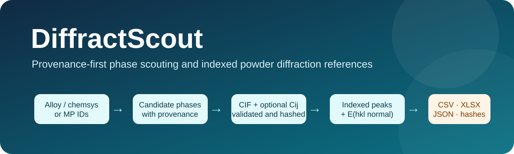

<p align="center">
  
</p>

# DiffractScout

[](https://github.com/D-sudoasd/DiffractScout/actions/workflows/ci.yml)
[](https://github.com/D-sudoasd/DiffractScout/actions/workflows/draft-pdf.yml)
[](LICENSE)
[](pyproject.toml)

**DiffractScout turns a chemical-system question or a folder of CIF files into a verifiable theoretical powder-diffraction reference bundle.** It preserves database identity, exact CIF hashes, structural diagnostics, radiation settings, optional elastic-tensor provenance, indexed reflections, warnings, and file checksums in one workflow.

[中文说明](README.zh-CN.md) · [GUI guide](docs/GUI.md) · [Scientific contracts](docs/SCIENTIFIC_CONTRACTS.md) · [Architecture](docs/ARCHITECTURE.md) · [Validation](docs/VALIDATION.md) · [Analytic benchmarks](docs/ANALYTIC_BENCHMARKS.md) · [JOSS readiness](docs/JOSS_READINESS.md)

## Why this software exists

Candidate-phase assessment commonly involves several disconnected operations: interpret an alloy grade, enumerate chemical subsystems, query a computed-materials database, download structures, inspect CIF metadata, calculate theoretical reflections, locate elastic constants, and prepare tables for experimental planning. Ad hoc scripts often lose the relationship between the provider record, exact CIF setting, tensor basis, diffraction settings, and final spreadsheet.

DiffractScout represents that chain as one research object. It supports two entry points:

| Workflow | Input | Main output |
|---|---|---|
| Local structure analysis | CIF files or folders | Validated structures, indexed theoretical reflections, optional paired `Cij`, profiles, diagnostics, manifest |
| Candidate-phase pipeline | Alloy grade, formula, chemical system, or Materials Project IDs | Candidate catalogue, downloaded conventional CIFs, optional DFT tensors, diffraction tables, provenance, diagnostics, manifest |

The base installation works offline. Materials Project access is optional and uses the researcher's own API key.

## Graphical interface

```bash
python -m pip install -e .
diffractscout-gui
# equivalent: diffractscout gui
```

<p align="center">
  
  
</p>

The desktop interface exposes the scientific controls used by the Python API: radiation definition, angular window, *d*-spacing filters, profile model and spacing, pseudo-Voigt parameters, pattern axis, optional continuous patterns and figures, elastic-tensor pairing, candidate limits, reciprocal-space resource guards, overwrite authorization, progress, structured diagnostics, Excel/lab-view dependencies, and result access. The API key remains in memory and is not written to project files. See [docs/GUI.md](docs/GUI.md).

On Windows, double-click `启动DiffractScout.bat` after an editable install, or drag CIF files onto `quick_export_diffractscout.bat` for a one-shot lab export.

## CIF2Peaks parity features

DiffractScout reimplements the CIF2Peaks desktop workflow inside a provenance-first package (Gemmi engine; not bit-identical intensities). Practical parity includes:

| Capability | Where |
|---|---|
| Laboratory Excel views (Chinese beginner peak table + usage guide sheets, when Excel and `export_lab_views` are enabled) | `export_lab_views` / CLI `--no-lab-views` to disable |
| Optional *d*-spacing window (intersects the 2θ search) | CLI/API `--d-min` / `--d-max` |
| Bilingual lab-facing tables with English canonical CSV/XLSX | Conditional Excel sheets `推荐峰表` / `使用说明` plus English `Peaks` |
| One-shot quick export (Cu Kα lab defaults, optional `.xlsx` shortcut) | `diffractscout-quick-export`, `diffractscout quick-export`, Windows drag-and-drop bat |
| Optional 2θ figure generation | CLI `--figures`; SVG/PNG bundle figures work in the base install, while `.[figures]` enables the matplotlib rendering path and paper-figure tooling |

Column-name mapping and intensity-channel aliases: [docs/SCHEMA_ALIASES.md](docs/SCHEMA_ALIASES.md). Engine semantics vs CIF2Peaks/pymatgen: [docs/ENGINE_PARITY.md](docs/ENGINE_PARITY.md).

## Installation

### Local CIF analysis

```bash
git clone https://github.com/D-sudoasd/DiffractScout.git
cd DiffractScout
python -m pip install -e .
```

### Materials Project support

```bash
python -m pip install -e ".[mp]"
export MP_API_KEY="your-key"     # PowerShell: $env:MP_API_KEY = "your-key"
```

### Optional extras

```bash
python -m pip install -e ".[figures]"   # optional matplotlib rendering path / paper figures
python -m pip install -e ".[gui-dnd]"   # optional Tk drag-and-drop helper
python -m pip install -e ".[mp]"        # Materials Project
```

### Development environment

```bash
python -m pip install -e ".[test]"
pytest -q
```

## Five-minute offline verification

The demo uses an explicitly synthetic FCC structure and a synthetic isotropic stiffness tensor. It contains no experimental property values.

```bash
diffractscout demo -o outputs/demo
diffractscout verify outputs/demo
```

Expected terminal result:

```text
Analyzed phases: 1
PASS
```

## Analytic scientific benchmark

The packaged benchmark compares the numerical core with closed-form simple-cubic, BCC, FCC, NaCl, and cubic-elasticity solutions. It writes exact fixtures, expectations, tolerances, software versions, portable runtime metadata, a human-readable report, and a self-verifying SHA-256 manifest.

```bash
diffractscout benchmark -o outputs/analytic_benchmark
```

Expected result:

```text
Checks: 45/45 passed
PASS
```

Set `SOURCE_DATE_EPOCH` when an archive requires reproducible generated timestamps. See [docs/ANALYTIC_BENCHMARKS.md](docs/ANALYTIC_BENCHMARKS.md).

## Analyze local CIF files

```bash
diffractscout analyze path/to/cifs -o outputs/local_cifs
```

Example for 83 keV synchrotron radiation:

```bash
diffractscout analyze path/to/cifs -o outputs/83keV \
  --energy-keV 83 \
  --two-theta-min 0.5 \
  --two-theta-max 15 \
  --step 0.005 \
  --fwhm 0.03
```

When a uniquely paired `{cif_stem}_elasticity.json`, compatible sidecar, or unambiguous elasticity index is present, DiffractScout validates the 6×6 matrix and can populate `young_modulus_hkl_normal_GPa`. Use `--no-elasticity` to disable discovery, copying, and evaluation of all elastic data.

Batch commands use machine-actionable exit codes: `0` for a complete successful analysis, `3` for a usable bundle containing one or more failed items, and `2` when no phase can be analyzed or a fatal input/configuration error occurs. Successful phases and failed items remain separated in `diagnostics.csv`.

## Discover candidate phases

```bash
diffractscout discover "Ti-6Al-4V" -o outputs/ti64_candidates \
  --mode near_stable \
  --e-hull-max 0.05 \
  --max-subsystem-order 3 \
  --max-subsystems 4096 \
  --max-total 100
```

This command records the query and candidate catalogue without downloading structures. Before provider access, DiffractScout estimates the number of chemical-subsystem queries and rejects expansions above `--max-subsystems` (default 4096). This guard prevents accidental combinatorial query growth; raising it is an explicit scope decision.

## Run the complete pipeline

```bash
diffractscout run "Ti-Al-V" -o outputs/ti_al_v \
  --mode near_stable \
  --e-hull-max 0.05 \
  --max-total 50
```

The Materials Project path requests conventional-standard cells by default. Automatic `hkl`-normal elasticity uses the raw/POSCAR-format tensor paired with that cell setting. An IEEE-only tensor is retained with status `frame_transform_required`; directional modulus fields remain empty until a verified coordinate transformation is supplied. Primitive-cell acquisition therefore requires `--no-elasticity`.

Candidate counts above `--confirm-above` require `--yes`. The GUI applies an explicit maximum-candidate authorization for every download run.

## Result bundle

A successful run is first written to a sibling staging directory, verified, and then moved into place. An existing bundle can be replaced only when its manifest is recognized, its current contents pass integrity verification, and overwrite was explicitly authorized. A failed query, calculation, export, or verification leaves the previous valid bundle in place.

| File | Purpose |
|---|---|
| `inputs/` | Copied local inputs or provider-downloaded CIF and elasticity artifacts |
| `candidate_index.csv` | Candidate identity, subsystem, stability metadata, provider URL |
| `download_index.csv` | Structure download and elasticity-query outcomes, errors, hashes |
| `phase_summary.csv` | CIF hash, selected block, unit cell, space group, occupancy, warnings |
| `peak_reference.csv` | Indexed theoretical reflections and optional `hkl`-normal modulus |
| `pattern_profiles.csv` | Conditional continuous profiles using the selected `profile_model` |
| `elasticity.csv` | Numerical tensors, coordinate frames, source records, warnings |
| `diagnostics.csv` | Structured discovery, download, elasticity, and analysis diagnostics |
| `results.xlsx` | Conditional human-readable workbook when Excel output is enabled |
| `provenance.json` | Settings, definitions, provider metadata, software versions, boundaries |
| `manifest.json` | SHA-256 and byte-size inventory checked by `diffractscout verify` |

The verifier rejects missing files, modified files, malformed entries, duplicate or unsafe paths, symbolic links, and files that are present but absent from the manifest.

## Scientific scope

DiffractScout calculates a kinematic theoretical powder reference from the average CIF structure. It does not perform experimental phase identification, Rietveld/Le Bail/Pawley refinement, quantitative phase analysis, detector calibration, background fitting, preferred-orientation correction, absorption correction, size/strain analysis, or absolute intensity calibration.

The reflection table reports:

```text
I_no_LP   = multiplicity × |F_xray|²
I_with_LP = I_no_LP × LP(θ)
J_with_LP = I_with_LP / V_cell²
J_no_LP   = I_no_LP / V_cell²
```

The legacy fields `material_scattering_factor_R_hkl` and `material_scattering_factor_R_hkl_no_lp` remain as compatibility aliases for the two project-defined `J` channels. They are not crystallographic residual factors, standardized quantitative-phase coefficients, or experimentally calibrated scattering factors.

The continuous pseudo-Voigt profile is a visualization product with user-supplied width and mixing fraction. Resource guards cap both profile-grid size and the conservative reciprocal-lattice candidate estimate before memory-intensive work begins.

Full equations, units, tensor convention, coordinate-frame rules, structure validation, and exclusions are defined in [docs/SCIENTIFIC_CONTRACTS.md](docs/SCIENTIFIC_CONTRACTS.md).

## Reliability and validation

The offline pytest suite covers composition parsing, subsystem enumeration, case-insensitive and collision-safe CIF collection, CIF block and space-group resolution, crystallographic occupancy conversion, systematic absences, analytic structure factors, Bragg geometry, intensity channels, boundary reflections, stiffness-unit conversion, resource limits, tensor validation, sidecar pairing, provider failure semantics, transactional replacement, spreadsheet safety, workbook schemas, end-to-end export, strict bundle verification, and the JOSS readiness machinery. Its collected-test count is reported by pytest/CI rather than copied into static documentation. The separate analytic suite performs a stable 45 closed-form checks.

GitHub Actions is configured for:

- Ubuntu tests on Python 3.10–3.13 with coverage and Ruff;
- Windows and macOS smoke tests;
- a headless Linux GUI startup check under Xvfb;
- wheel build and clean-environment installation;
- the offline scientific demo and bundle verification;
- Open Journals draft-PDF compilation;
- deterministic release evidence archives, monthly reproducibility snapshots, and monthly dependency-update pull requests.

The synthetic suite validates declared numerical contracts. Real-material comparisons and research-use evidence required for a JOSS submission are tracked separately in [docs/VALIDATION.md](docs/VALIDATION.md) and [docs/JOSS_READINESS.md](docs/JOSS_READINESS.md). The scheduled monthly audit records reproducibility at a public commit; it does not count as substantive development unless a resulting discrepancy, dependency update, validation result, documentation improvement, or user report is reviewed and committed publicly.

## Python API

```python
from diffractscout import AnalysisSettings, analyze_cifs

result = analyze_cifs(
    ["path/to/cifs"],
    "outputs/example",
    settings=AnalysisSettings(
        input_mode="energy",
        energy_keV=83.0,
        two_theta_min_deg=0.5,
        two_theta_max_deg=15.0,
        max_profile_points=500_000,
        max_reflection_estimate=1_000_000,
    ),
)
print(result.manifest_path)
print(result.diagnostics)
```

See [docs/API.md](docs/API.md) for provider and lower-level interfaces.

## Architecture and relationship to existing software

DiffractScout uses Gemmi for CIF and crystallographic computation, spglib for an independent symmetry cross-check, and optional `mp-api`/pymatgen for Materials Project access. GSAS-II, pyFAI, and related packages remain appropriate for experimental integration, calibration, fitting, and refinement. DiffractScout stops at candidate screening and auditable theoretical references.

The project integrates and restructures functionality from two MIT-licensed repositories maintained by the same author:

- [`D-sudoasd/PhaseScout`](https://github.com/D-sudoasd/PhaseScout)
- [`D-sudoasd/CIF2Peaks`](https://github.com/D-sudoasd/CIF2Peaks)

Those repositories remain independent and unchanged by this project. Source snapshots, retained behavior, architectural changes, and license notices are documented in [docs/SOURCE_LINEAGE.md](docs/SOURCE_LINEAGE.md) and [NOTICE.md](NOTICE.md). The build-vs-contribute rationale is in [docs/COMPARISON.md](docs/COMPARISON.md).

## JOSS preparation status

The repository contains an OSI-approved license, installable package metadata, tests, analytic benchmarks, CI, user and API documentation, governance, examples, contribution and support routes, tag-driven deterministic release packaging, a monthly reproducibility audit, dependency-update automation, a JOSS-format manuscript, and a specific AI usage disclosure. The public-development clock began on 12 August 2026. Formal submission remains blocked by the six-month/distributed-history gate, a completed real multiphase research case, independent diffraction and elasticity validation, external engagement, and human-confirmed metadata. The immutable software archive DOI is required after successful JOSS review for the publication stage, not for the initial submission. First run `python scripts/check_release.py` to create the current-source release receipt, then use `python scripts/joss_readiness.py --stage release|submission|publication`; see [docs/JOSS_READINESS.md](docs/JOSS_READINESS.md) and [docs/JOSS_REVIEW_CHECKLIST.md](docs/JOSS_REVIEW_CHECKLIST.md).

## Contributing, support, and citation

- Development and scientific-validation contributions: [CONTRIBUTING.md](CONTRIBUTING.md)
- Reproducible software bugs and feature requests: GitHub Issues
- Security-sensitive reports: [SECURITY.md](SECURITY.md)
- Citation metadata: [CITATION.cff](CITATION.cff)
- Governance and support: [GOVERNANCE.md](GOVERNANCE.md) · [SUPPORT.md](SUPPORT.md)
- Validation-case registry: [validation_cases/README.md](validation_cases/README.md)
- Six-month evidence plan: [docs/JOSS_6_MONTH_PLAN.md](docs/JOSS_6_MONTH_PLAN.md)
- Release procedure: [docs/RELEASE.md](docs/RELEASE.md)

Create a tagged, archived release before citing a specific production version or submitting to JOSS.

## License

MIT. See [LICENSE](LICENSE) and [NOTICE.md](NOTICE.md).
