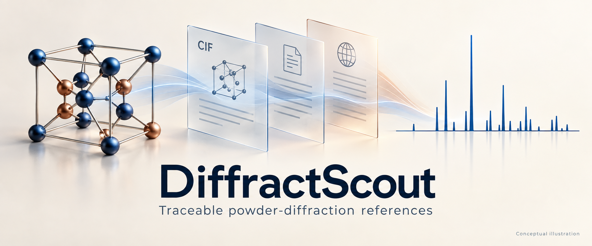
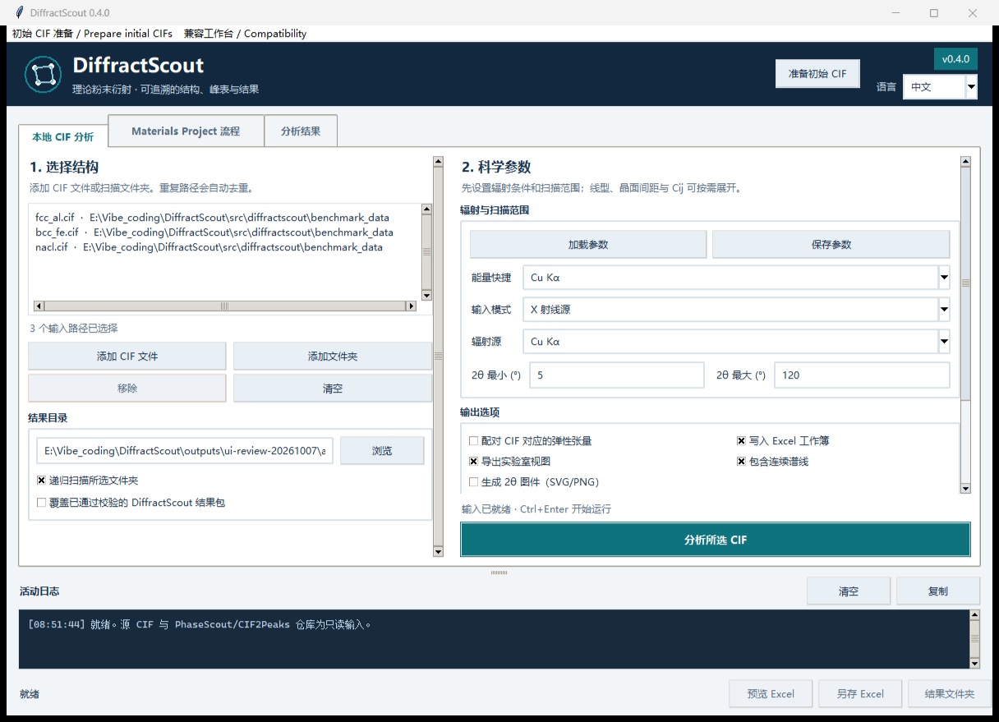
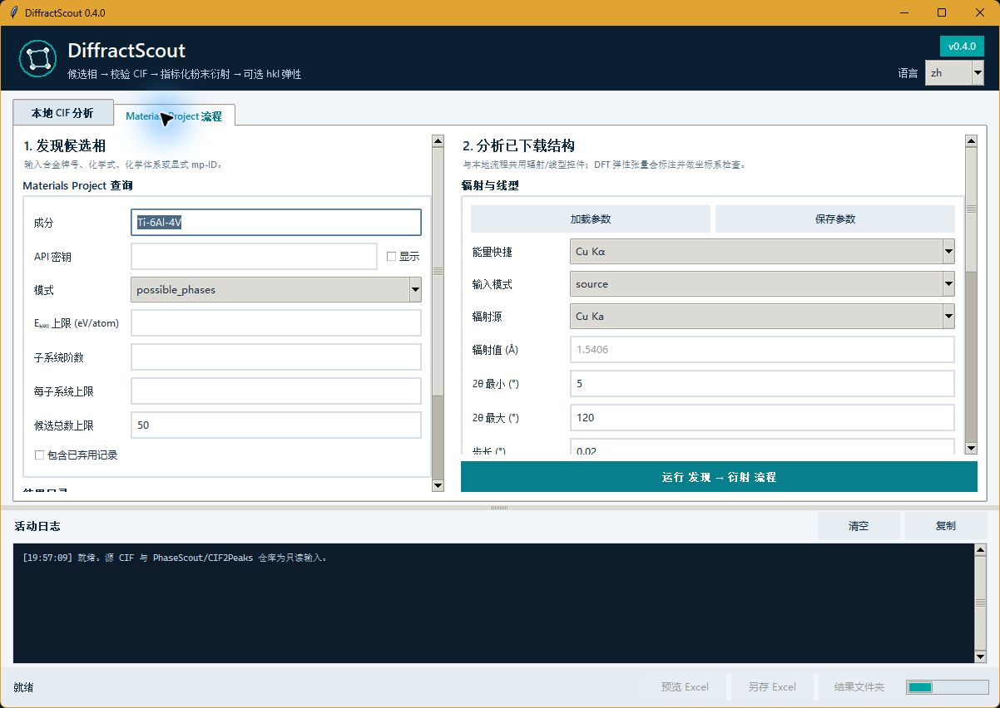

<p align="center">
  
</p>

# DiffractScout 中文说明

**从本地 CIF 或化学体系检索出发，生成带来源、诊断和校验清单的理论衍射参考。**

[图形界面与安装](#图形界面) · [CLI](docs/CLI.md) · [科研约定](docs/SCIENTIFIC_CONTRACTS.md) · [英文主页](README.md)

[](https://github.com/D-sudoasd/DiffractScout/actions/workflows/ci.yml) [](LICENSE) [](pyproject.toml)



**第一次使用：** 在源码目录运行 `python -m pip install -e .`，再运行 `diffractscout-gui` 并导入本地 CIF。基础本地分析可离线使用；Materials Project 查询为可选功能，需要使用者自己的 API 密钥。

**输入到输出：** CIF 与辐射条件 → 结构诊断和带索引的理论峰 → 数据表、可选谱线与图件、来源记录和校验清单。理论参考用于实验比较，不能单独证明样品中的物相。

**源码与发行：** 当前源码为 `v0.4.0 Unreleased`，最新正式发行版为 `v0.3.0`。桌面支持目标为 Windows；平台、依赖和完整版选项见下方详细说明。

<details>
<summary>Platform, complete edition and release details / 平台、完整版与发布详情</summary>

本项目以 **Windows** 为使用和验收平台。Linux CI 保留用于基础代码验证，
macOS 桌面不作为支持目标。命令行输出统一为 UTF-8，重定向或通过其他程序
调用时也应使用 UTF-8 解码，避免英文 Windows 环境下的中文编码错误。

本轮增加了内置的 CIF2Peaks、PhaseScout 兼容工作台。使用
`python -m pip install ".[complete]"` 安装全部依赖后，可从主窗口的
“兼容工作台”菜单打开，也可运行 `diffractscout compat --help` 查看命令。
两个原项目的源码目录不再是运行依赖；原有导出格式和计算引擎仍有明确区分。
功能逐项对照及验证边界见[替代性审计](docs/REPLACEMENT_AUDIT.md)。

> **状态：** 最新正式 [GitHub Release 为 v0.3.0](https://github.com/D-sudoasd/DiffractScout/releases/tag/v0.3.0)。当前源码和包文件为 **v0.4.0 Unreleased（未发布）**，支持 Python **3.10–3.13**。可从源码或构建的 wheel 安装；不宣称已有 PyPI 发布版本。安装 `.[complete,windows]` 后，可运行 `python scripts/package_windows_portable.py --build` 构建包含两个兼容工作台的 Windows 便携版。仓库启动器需要 Python，生成的便携版启动器使用随包 EXE。本地构建通过不等于已经公开发布。

**DiffractScout 将合金/化学体系候选相检索、本地 CIF 检查、理论粉末衍射计算、可选晶面法向弹性分析和可验证结果导出连接为一个流程。** 每项结果均可追溯到数据库记录或本地文件、CIF 哈希、辐射条件、计算定义、软件版本和结构化诊断。

[英文主页](README.md) · [CLI 使用说明](docs/CLI.md) · [API](docs/API.md) · [GUI 使用说明](docs/GUI.md) · [科研计算约定](docs/SCIENTIFIC_CONTRACTS.md) · [验证策略](docs/VALIDATION.md) · [发布流程](docs/RELEASE.md) · [JOSS 准备状态](docs/JOSS_READINESS.md)

</details>

## 主要工作流

使用与开发入口：[文档索引](docs/README.md) · [贡献指南](CONTRIBUTING.md) ·
[项目协作约定](AGENTS.md) · [开发与 agent 工作流](docs/AGENT_WORKFLOW.md)。

| 工作流 | 输入 | 主要输出 |
|---|---|---|
| 本地 CIF 分析 | 单个或多个 CIF、CIF 文件夹 | 结构检查、理论峰表、可选 `Cij` 配对、连续显示谱线、诊断和校验清单 |
| Materials Project 流程 | 合金牌号、化学式、化学体系或 `mp-` 编号 | 候选相、常规标准晶胞、可选 DFT 弹性张量、理论衍射表、来源记录和校验清单 |
| 对称性原型与显式精修 | 化学体系，以及调用者给出的成分和带出处的晶格 | `alpha.cif`、`beta.cif`、`alpha-double-prime.cif`，以及一份新 CIF 和 adapt 侧车 |
| 初始 CIF 准备 | 牌号或明确百分比，以及可选的逐相引用参数 | 可载入的初始 CIF、原始来源、拟合建议、理论峰表预览及完整性清单 |

基础安装可以离线分析本地 CIF。Materials Project 支持为可选依赖，API 密钥由用户自行提供。

## 图形界面

```bash
python -m pip install -e .
diffractscout-gui
# 等价命令：diffractscout gui
```

<p align="center">
  
  
</p>

界面提供：CIF 文件与文件夹批量选择、递归扫描、光源/能量/波长、`2θ` 范围、`d` 过滤、线型模型、步长、FWHM、伪 Voigt 混合参数、CSV/Excel 谱线坐标、连续谱线与图件、弹性配对、候选相数量上限、倒易空间资源限制、覆盖授权、Excel/实验室视图依赖、运行状态、结构化日志和结果入口。API 密钥只保存在当前进程内存中，不写入项目文件。详见 [docs/GUI.md](docs/GUI.md)。

GUI 默认语言为中文（`zh`），可切换为 English。常用设置优先显示，线型、资源上限和 Cij 按需展开。完成运行后，界面自动显示结果概览、理论 2θ 图谱、可排序峰表和诊断筛选；初始 CIF 准备可从顶部按钮进入。截图仅作示意。

Windows 下可在可编辑安装后双击 `启动DiffractScout.bat` 启动界面；或将 CIF 拖到 `quick_export_diffractscout.bat` 进行一次实验室默认导出。两个仓库启动器都是源码 checkout 的便捷入口：经 `scripts/diffractscout_entry.py` 运行 checkout 源码，并按仓库 `.venv\Scripts\python.exe`、当前/激活的 `python`、`py -3` 顺序选择解释器。无 `.venv` 时，quick-export 启动器还会使用已安装的 `diffractscout-quick-export`。安装后的 `diffractscout-gui` / `diffractscout gui` / `diffractscout-quick-export` 不依赖仓库启动器。

## 已吸收 CIF2Peaks 桌面能力

DiffractScout 在可追溯结果包中重实现了 CIF2Peaks 的主要桌面工作流（离线引擎为 Gemmi，强度为语义对齐而非逐字节一致）：

| 能力 | 入口 |
|---|---|
| 实验室 Excel 视图（中文推荐峰表 + 使用说明） | `export_lab_views`；CLI `--no-lab-views` 可关闭 |
| *d* 间距过滤窗口（与 2θ 搜索求交） | CLI/API `--d-min` / `--d-max` |
| 中英双语：中文实验室表 + 英文规范列名 CSV/XLSX | 工作簿 `推荐峰表` / `使用说明` 与 `Peaks` |
| 一键快速导出（Cu Kα 实验室默认，可选 `.xlsx` 快捷路径） | `diffractscout-quick-export`、`diffractscout quick-export`、Windows 拖放 bat |
| 可选 2θ 图件生成 | CLI `--figures`；基础安装可写 SVG/PNG 结果包图件，`.[figures]` 启用 matplotlib 渲染路径和论文制图工具 |

列名与强度通道别名见 [docs/SCHEMA_ALIASES.md](docs/SCHEMA_ALIASES.md)；与 CIF2Peaks/pymatgen 引擎差异见 [docs/ENGINE_PARITY.md](docs/ENGINE_PARITY.md)。

Excel 提供结果概览和工作表导航，按列的含义区分表头颜色，统一科学数值显示格式，冻结物相标识列，并用数据条辅助查看相内相对强度。界面支持保存、加载常用分析参数，以及独立的 Excel 预览、永久副本另存和结果文件夹入口。完整用法见 [Excel 结果使用说明](docs/EXCEL.md)。

CLI 同样可以保存、复用参数，并校验和查看已有结果包：

```powershell
diffractscout preset save -o presets/energy-30.json --energy-keV 30
diffractscout analyze path/to/cifs -o outputs/run --preset presets/energy-30.json
diffractscout inspect outputs/run --json
```

命令行显式参数优先于预设。批处理退出码、辐射条件覆盖和参数文件用法见 [CLI 使用说明](docs/CLI.md)。

启用 *d* 间距过滤时，程序会单独记录包含端点的 Bragg 求交结果。
`provenance.json` 和物相元数据区分用户请求的
`requested_two_theta_range_deg`、过滤后的
`effective_two_theta_range_deg`（无交集时为 `null`）、为兼容保留的
`two_theta_range_deg` 分析边界、实际采样端点
`profile_sampled_two_theta_range_deg`、`effective_window_empty`，以及几何
`geometric_d_min_A` 与过滤字段 `d_min_A`。

## 首次运行快速开始

以下命令应在 DiffractScout 源码 checkout 根目录执行。它们会创建虚拟
环境、安装当前源码、打印版本，并运行离线合成演示和结果包校验。

### Bash

```bash
python3 -m venv .venv
source .venv/bin/activate
python -m pip install -e .
diffractscout --version
diffractscout demo -o outputs/first-run
diffractscout verify outputs/first-run
```

### PowerShell

```powershell
py -3 -m venv .venv
.\.venv\Scripts\Activate.ps1
python -m pip install -e .
diffractscout --version
diffractscout demo -o outputs/first-run
diffractscout verify outputs/first-run
```

成功时应看到 `diffractscout 0.4.0`、`Analyzed phases: 1` 和 `PASS` 等关键
输出。演示使用合成数据且离线运行，只验证安装与结果包完整性，不证明实验
科学有效性。重跑时请使用新的输出目录；只有在已有目录先通过
`diffractscout verify` 且确认它是 DiffractScout 结果包时，才可以显式使用
`--overwrite`。

## 安装

本地 CIF 分析：

```bash
git clone https://github.com/D-sudoasd/DiffractScout.git
cd DiffractScout
python -m pip install -e .
```

Materials Project 支持：

请安装可选的 `mp` extra，并通过环境变量提供你自己的密钥。下方仅使用
占位符，绝不要提交、粘贴或分享真实密钥；自动化环境优先使用密钥管理器或
交互式输入，并在使用后清除变量。DiffractScout 只在进程内存中使用密钥，
不会写入结果包。

### Bash

```bash
python -m pip install -e ".[mp]"
export MP_API_KEY="replace-with-your-key"
diffractscout discover "Ti-Al-V" -o outputs/ti_al_v_candidates
unset MP_API_KEY
```

### PowerShell

```powershell
python -m pip install -e ".[mp]"
$env:MP_API_KEY = "replace-with-your-key"
diffractscout discover "Ti-Al-V" -o outputs/ti_al_v_candidates
Remove-Item Env:MP_API_KEY
```

可选依赖：

| Extra | 安装 | 用途 |
|---|---|---|
| base | `python -m pip install -e .` | 离线本地 CIF、CLI/API、合成演示和校验 |
| `mp` | `python -m pip install -e ".[mp]"` | Materials Project 检索/下载和可选 provider 元数据；需要自己的 API 密钥 |
| `figures` | `python -m pip install -e ".[figures]"` | 可选 matplotlib 渲染路径和论文制图工具 |
| `gui-dnd` | `python -m pip install -e ".[gui-dnd]"` | 可选 `tkinterdnd2` 文件/文件夹拖放；没有它仍可使用按钮式 GUI |
| `test` | `python -m pip install -e ".[test]"` | pytest、覆盖率、Ruff、YAML 支持和开发检查 |
| `release` | `python -m pip install -e ".[release]"` | 完整本地 release preflight 所需的 `build` 和 `twine` |

正式版本可安装其 GitHub Release 附带的 wheel；本项目不宣称已有 PyPI
发布版本。

开发与测试：

```bash
python -m pip install -e ".[test]"
pytest -q
```

普通开发和测试只需安装 `.[test]`。运行完整的本地 release preflight 前，
请安装测试与发布工具：
`python -m pip install -e ".[test,release]"`。

## 离线验证

```bash
diffractscout demo -o outputs/demo
diffractscout verify outputs/demo
```

演示使用明确标注的合成 FCC 结构和合成各向同性刚度张量，不包含实验材料性能数据。

## 解析科学基准

```bash
diffractscout benchmark -o outputs/analytic_benchmark
```

该命令对简单立方、BCC、FCC、NaCl 和立方晶体方向弹性执行 45 项闭式解检查，并输出固定输入、预期值、容差、软件版本、运行环境、报告和 SHA-256 清单。成功结果为 `45/45 passed`。详见 [docs/ANALYTIC_BENCHMARKS.md](docs/ANALYTIC_BENCHMARKS.md)。

另有可复现的 [pymatgen 独立数值对照](validation_cases/independent_engines/README.md)，比较相同合成 CIF 的峰位和立方晶体方向模量，并在 CI 中保留数值报告和依赖版本。

## 本地 CIF 分析

```powershell
diffractscout analyze D:\path\to\cifs -o D:\results\diffractscout_run
```

83 keV 同步辐射示例：

```powershell
diffractscout analyze D:\path\to\cifs -o D:\results\run_83keV `
  --energy-keV 83 --two-theta-min 0.5 --two-theta-max 15 `
  --step 0.005 --fwhm 0.03
```

当 CIF 旁存在唯一、可验证的弹性侧车或索引记录时，软件检查 6×6 `Cij` 并计算晶面法向杨氏模量。`--no-elasticity` 会关闭弹性文件发现、复制和计算。

批处理命令使用明确退出码：`0` 表示全部成功，`3` 表示结果包可用但存在失败对象，`2` 表示没有可分析物相或出现致命输入/配置错误。详细状态保存在 `diagnostics.csv`。

## Materials Project 完整流程

```powershell
$env:MP_API_KEY = "replace-with-your-key"
diffractscout run "Ti-Al-V" -o D:\results\ti_al_v `
  --mode near_stable --e-hull-max 0.05 `
  --max-subsystem-order 3 --max-subsystems 4096 --max-total 50
Remove-Item Env:MP_API_KEY
```

默认下载常规标准晶胞。raw/POSCAR 和 IEEE 格式张量会保留数值及来源，但由于当前 provider 没有持久化足够的上游结构取向，无法验证其到导出 CIF Cartesian 坐标系的变换，因此两者均标记为 `frame_transform_required`，不输出方向模量，直至用户提供经过验证的坐标变换。原胞下载需要同时使用 `--no-elasticity`。软件会在访问数据库前估算化学子体系查询数量，超过 `--max-subsystems`（默认 4096）时停止，避免高元体系产生组合式查询膨胀。

## 对称性原型与成分、晶格精修

推荐先使用主窗口的“初始 CIF”菜单，或一次生成完整起始模型包：

```powershell
diffractscout prepare-cifs TC4 -o outputs/TC4_initial --offline
diffractscout verify outputs/TC4_initial
```

TC4、Ti64、Ti-6Al-4V 在这个新入口中会按名义 6 wt% Al、4 wt% V 展开。
宿主默认按最大的原子分数确定，不受元素输入顺序影响。其它合金须明确
`--wt` 或 `--at`，也可以用 `--host` 指定母相宿主。
最终应载入 `initial/` 中的 CIF，并阅读 `report.md`。
三种 Ti 相族均有带出处的离线原型；缺少目标合金参数时，报告和 CIF 内会
明确写出“原型晶格、初始成分假设”，不会宣称已经得到该样品的精修结构。

有目标相文献值时，复制[逐相参数模板](examples/phase_parameters.template.json)，
填入晶格、引用和适用条件，再增加 `--parameters your-parameters.json`。
可以逐相指定实际相成分，替代整体合金占位假设。在线模式会检查候选真实
原子位点，对可复核的 P1 数据恢复显式空间群，拒绝仅有同一空间群的多轨道
化合物，并保留原始 CIF。详见[初始 CIF 使用指南](docs/INITIAL_CIFS.md)。

要的是某一个 α、β 或 α'' 晶胞时，用下面两条命令。`run "Ti64"` 会在整个 Ti-Al-V 体系里检索，结果里会包括金属间化合物；它不负责把原型改成指定合金的占位和晶格。

```powershell
diffractscout fetch-prototypes "Ti-6Al-4V" -o prototypes `
  --phase alpha --phase beta --phase alpha-double-prime
diffractscout adapt prototypes\alpha.cif -o TC4_alpha.cif `
  --nominal tc4 --a 2.935 --c 4.673 `
  --citation "作者, 期刊, 卷, 页, 年份, DOI"
```

`fetch-prototypes` 只复制对称性原型，并写 `prototype_index.csv`。这一步的 `target_composition` 一律是 `false`。

- `alpha`：空间群 194。D0₁₉（例如 Ti₃Al）和 C14 不会进入。ω 是 191，也不会进入。
- `beta`：空间群 229。成分字符串里的第一个元素是宿主；有该元素的单质原型时优先用它，所以 Ti-Al-V 的 β 是 Ti，而不是 V。这里不用能量上限，因为 β-Ti 明显高于常见的 near-stable 阈值。
- `alpha-double-prime`：空间群 63，化学元素必须落在给定体系内。Ti 宿主在库里没有合格结构时，使用随包附带的 COD 1523304。那是 Ti–20 at% Nb 的 Cmcm 骨架，晶格和 Nb 占位都属于 Brown 等人 1964 年的那条记录。索引会写明这一点；其它宿主须提供合格候选或模板。

已有对称性完整的 CIF 时，可以用 `--template alpha=路径` 跳过数据库。Materials Project 常规 CIF 常被标成 P1；`adapt` 要求文件里的 Hermann–Mauguin 符号已经和结构一致，这种 P1 文件会被拒绝。

文献里的晶格常数由调用者查完后写在命令里。软件不从论文抽取数字。建议按这个顺序做：

1. 先跑 `fetch-prototypes`。状态为 `scaffold` 或 `template` 的文件，其晶格和占位仍是来源结构。
2. 按用户给的成分查该相的实测晶格。优先同一合金、同一相、室温、并写明热处理。记下出处、条件和不确定度。
3. 论文没有该相的晶格时，停下来说明缺哪一项。借用相近合金时，出处和文件名都要写明这是对照，而不是目标合金的实测。
4. 论文没给的坐标保持原型原值。α'' 的 `y` 只有在论文报告了它，或用户明确写了 `--fract y=...` 时才改。
5. 名义合金成分和平衡分配后的相成分分开。马氏体可以继承母相成分；Ti-6Al-4V 里平衡 α、β 通常经过分配，不是整体的 6Al–4V。
6. 再跑 `adapt`，并把加载器的空间群交叉检查结果告诉用户。结果必须是 `match`，否则文件不会留下。

`--nominal tc4`、`ti64`、`ti-6al-4v` 只表示常规牌号：6 wt% Al、4 wt% V、余量 Ti。这是名义牌号。`discover` 和 `run` 里的同名别名仍然只表示元素集合 Ti、Al、V。其它合金用 `--wt Ti=90,Al=6,V=4` 或 `--at`。百分数之和要在 100±0.05 以内。占位先保留五位小数，残差加到输入顺序的最后一个元素上，使总和正好为 1。

未指定的独立轴、角度和分数坐标保持原型值。六方/四方的 a、b 自动联动，立方的 a、b、c 自动联动；显式给出相互矛盾的等价轴会被拒绝。改了晶格或坐标就必须有 `--citation`。只改成分时不需要。新文件旁边会有 `名称.adapt.json`，里面有来源 CIF 的 SHA-256、成分依据、出处、改过的轴和按对称性联动的轴。化学式、Z、化学式质量按实际展开的占位和位点重算。源文件、已存在的目标文件和侧车都不会被覆盖。

没有 API key 时，只请求 `alpha-double-prime` 也可以完成，走的是 COD 骨架。请求 α 或 β 时需要 key，或者用 `--template`。设置了 key 时，α'' 会先检索；没有合格 Cmcm 结构才退回骨架。

## 结果包与写入安全

程序先在同级临时目录生成全部结果并执行完整性校验，通过后才移动到目标目录。覆盖已有结果需要同时满足：

1. 用户明确授权覆盖；
2. 目标目录包含已识别的 DiffractScout 清单；
3. 现有结果包当前能够通过 SHA-256 和文件清单校验。

查询、计算、导出或校验失败时，上一份有效结果不会被提前删除。

主要文件包括：

- `phase_summary.csv`：CIF 哈希、晶胞、空间群、占位和结构警告；
- `peak_reference.csv`：`hkl`、`d`、`2θ`、`q`、`g`、多重性、结构因子、LP/无 LP 通道及可选方向模量；
- `candidate_index.csv`、`download_index.csv`：候选相、下载和弹性查询状态；
- `diagnostics.csv`：检索、下载、弹性和结构分析中的结构化警告与错误；
- `pattern_profiles.csv`：仅在启用连续谱线时按所选线型模型导出的谱线；
- `results.xlsx`：启用 Excel 时生成的人类可读工作簿；实验室视图仅在 Excel 与 `export_lab_views` 同时启用时出现；
- `provenance.json`：计算设置、有效输出标志、定义、来源与软件版本；
- `manifest.json`：文件 SHA-256 与字节数清单。

`diffractscout verify` 会拒绝文件缺失、内容修改、重复/不安全路径、符号链接以及未列入清单的新增文件。

## 科学适用边界

当前版本输出运动学理论粉末衍射参考。它不执行实验物相自动鉴定、Rietveld/Le Bail/Pawley 精修、定量物相分析、探测器或仪器标定、背景拟合、织构/吸收修正、尺寸与微应变分析或绝对强度标定。

理论强度通道为：

```text
I_no_LP   = 多重性 × |F_xray|²
I_with_LP = I_no_LP × LP(θ)
J_with_LP = I_with_LP / V_cell²
J_no_LP   = I_no_LP / V_cell²
```

兼容字段 `material_scattering_factor_R_hkl` 和 `material_scattering_factor_R_hkl_no_lp` 对应上述两个 `J` 通道。它们不表示晶体学残差因子、标准化定量物相系数或实验标定散射因子。连续伪 Voigt 谱线用于显示，峰宽和混合参数均由用户指定。

模式字段 `formula_weight_g_mol` 表示扩展后的晶体学晶胞质量（g/mol）：对
晶胞中所有有占位的原子位点求和，并包含晶体学倍数 `Z`；它不是经验式摩尔
质量。连续谱线的 `pattern_axis` 是从均匀 `2theta` 网格变换得到的坐标，
不是在均匀 `q` 或 `d` 网格上重新采样，也不施加 Jacobian；规范字段名
`two_theta_deg`、`d_A`、`q_invA`、`g_invA`、`x_axis_mode` 和 `x` 保持不变。

详细公式、单位、弹性 Voigt 约定、坐标系规则、资源上限和排除项见 [docs/SCIENTIFIC_CONTRACTS.md](docs/SCIENTIFIC_CONTRACTS.md)。

## 验证与 JOSS 状态

当前离线 pytest 套件覆盖成分解析、子体系枚举及组合数量上限、大小写 CIF 扫描、同名文件防覆盖、CIF 数据块和空间群解析、特殊位置占位转换、系统消光、解析结构因子、Bragg 几何、边界反射、刚度单位换算、弹性张量检查、侧车配对、资源限制、数据库失败语义、事务式输出、电子表格安全、确定性证据归档、严格清单校验和投稿准备检查。测试收集数由 pytest/CI 报告，不再复制到静态文档；另有稳定的 45 项解析科学基准。GitHub Actions 还配置了多 Python 版本、Windows、Linux 无头 GUI、wheel 安装、解析基准、发布制品、月度复现审计、依赖更新和 JOSS 论文构建。月度定时运行只记录某一公开提交的可复现状态；只有由真实缺陷、依赖更新、验证、文档改进或用户反馈形成的公开提交、Issue、Pull Request 或 Release 才构成开发活动证据。

作者已确认软件用于其已发表研究，代表论文及具体使用情况将在投稿记录中补充。项目自 2026 年 8 月 12 日开始公开开发，目前尚未满足 JOSS 超过六个月的持续公开开发要求。项目自定的科学验证、社区参与要求与 JOSS 官方门槛分别列于 [投稿准备状态](docs/JOSS_READINESS.md)。先执行 `python scripts/check_release.py` 验收当前软件，再用 `python scripts/joss_readiness.py --stage submission --output build/joss-readiness` 检查待补的投稿证据和作者确认事项。最终软件归档 DOI 在审稿完成后的 `publication` 阶段补入；工作计划见 [docs/JOSS_6_MONTH_PLAN.md](docs/JOSS_6_MONTH_PLAN.md)。

## 来源与许可

DiffractScout 整合并重构了同一作者维护的两个 MIT 项目中的功能：

- `PhaseScout`
- `CIF2Peaks`

两个原仓库保持独立，未因本项目修改。来源快照、保留功能、架构变化和许可证说明见 [docs/SOURCE_LINEAGE.md](docs/SOURCE_LINEAGE.md) 与 [NOTICE.md](NOTICE.md)。

许可证：MIT。引用元数据见 [CITATION.cff](CITATION.cff)。
