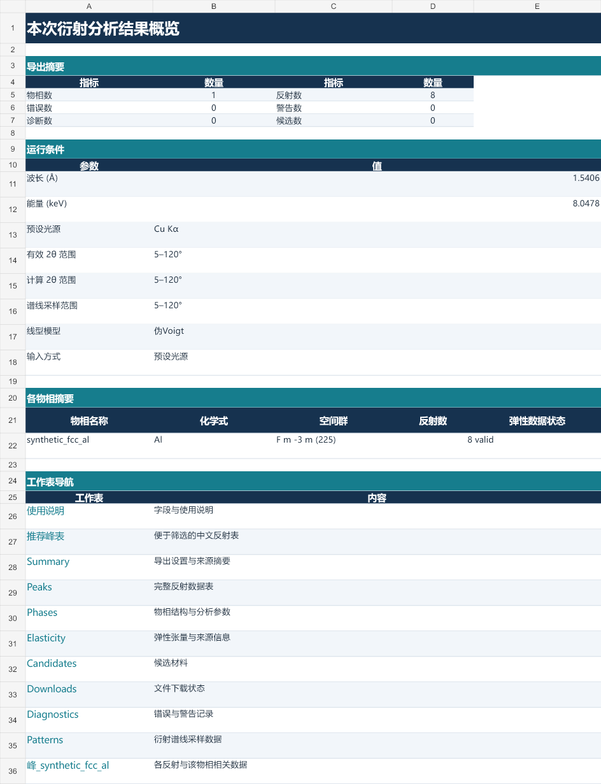

# Working with Excel results

DiffractScout exports a complete result bundle and an optional `results.xlsx`.
The workbook is a presentation of the calculated results: cell formatting does
not round the stored numbers or change the scientific definitions. The English
data-sheet headers still match their CSV counterparts.

## Start with the result overview

The overview brings together the number of analyzed phases and reflections,
diagnostic counts, calculation conditions, and links to the detailed worksheets.
Use the diagnostics link when a run contains warnings or failed inputs; a
partially successful run can still contain usable phase results.

Laboratory views add Chinese labels and the `推荐峰表` and `使用说明` sheets.
With laboratory views disabled, the canonical English sheets remain available.



## Find and compare reflections

1. Open `推荐峰表` or `Peaks` and filter the phase-name column.
2. Sort `normalized_intensity` descending, or `rank_by_intensity` ascending,
   to find the strongest calculated reflections in that phase.
3. Compare `two_theta_deg` at the experimental wavelength. When comparing
   different wavelengths, use `d_spacing_A` instead.
4. Expand grouped detail columns for source hashes, intensity definitions,
   and additional metadata.

The header and phase-identification columns remain visible while scrolling.
Column-group colors distinguish identity, Miller indices, geometry, intensity,
and elasticity. Alternating row shading and consistent numeric formats help
track a reflection across the table. Intensity bars use the existing 0–100
phase-relative scale; they do not measure phase fraction or make intensities
quantitatively comparable between phases. Percent columns already contain
values from 0 to 100 and are displayed without multiplying them by 100 again.

Blank scientific values remain blank. For example, a missing directional
modulus is not zero: inspect `elastic_status` and `elastic_note` for the reason.
The full field definitions are in [SCHEMA_ALIASES.md](SCHEMA_ALIASES.md).

## Keep an editable copy

The original bundle is an integrity-checked record. In the desktop interface:

- **Preview Excel** opens a temporary copy outside the result bundle.
- **Save Excel as** creates a permanent, editable copy at the location you choose.
- **Result folder** opens the complete bundle, including CSV, diagnostics,
  provenance, and the manifest.

Use **Save Excel as** for notes, filtering, or a workbook you intend to share.
Opening or editing a separate copy keeps Excel lock files and user edits out
of the verified bundle. If a preview was changed and saved, the application
retains it instead of deleting those changes on exit.

For a direct command-line Excel export:

```bash
diffractscout quick-export path/to/sample.cif -o outputs/sample.xlsx
diffractscout verify outputs/sample_bundle
```

This creates both `sample.xlsx` and `sample_bundle/results.xlsx`. The `.xlsx`
shortcut requires Excel output; use a directory output with `--no-excel` for
a CSV-only bundle. Existing output needs explicit `--overwrite` authorization.
If publishing the separate Excel copy fails, the error identifies the retained
bundle workbook so that the calculation does not need to be repeated.

## Automation and large tables

Use named worksheets or the CSV files in scripts rather than relying on the
active worksheet, visible columns, or display precision. Grouped columns keep
their original data and headers. The `Summary` sheet remains a two-column
`key` / `value` table.

The workbook uses the existing conservative limit of 900,000 data rows per
table. When a table exceeds that limit, its sheet contains an explicit omission
notice and the complete CSV remains in the bundle. Printed overview pages are
intended for a readable summary; use the full tables or CSV for detailed work.
