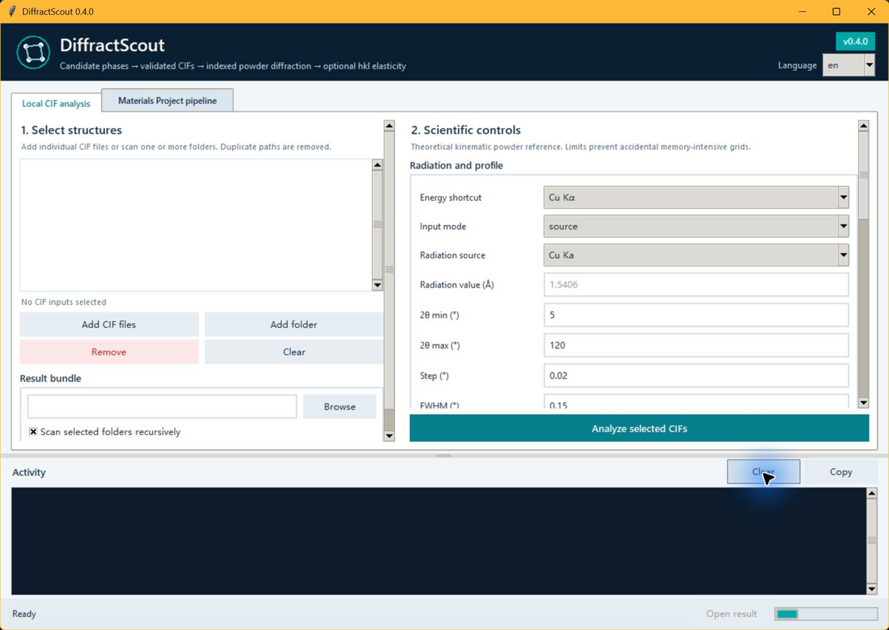
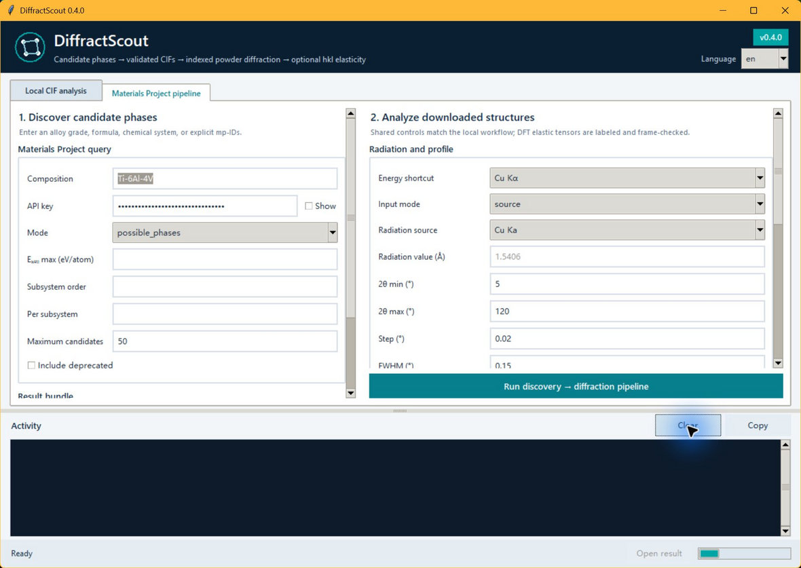

# Graphical interface guide

DiffractScout provides a Tk desktop interface for researchers who prefer to configure and inspect a run without composing command-line arguments. The interface delegates all scientific work to the same tested pipeline functions used by the CLI and Python API.

## Launch

```bash
diffractscout-gui
# equivalent
diffractscout gui
# or: python -m diffractscout gui
```

On Windows, after an editable or environment install, double-click
`启动DiffractScout.bat` in the repository root. The repository launcher uses
the checkout source and prefers interpreters in this order: the repository
`.venv\Scripts\python.exe`, the current/active `python`, then `py -3`. There is
no standalone Windows EXE yet, so a Python installation is required. The
repository launcher is only a convenient source-checkout entry point; an
installed `diffractscout-gui` or `diffractscout gui` does not require it. The
optional `scripts/package_windows_portable.py` file documents a future
PyInstaller layout; it does not ship an executable.

A normal Python installation with Tk support is required. On Linux, the operating-system package is commonly named `python3-tk` or `tk`.

Optional extra `.[gui-dnd]` installs `tkinterdnd2` and enables file/folder drop onto the local CIF list; the button-based workflow remains available without it.

The GUI starts in Chinese (`zh`). Use the language selector in the header to
switch between Chinese and English. Screenshots in this guide are
illustrative and may show English labels even though a fresh launch defaults
to Chinese.

## Layout and scrolling

Dense forms (radiation, Cij, export options) live in **vertically scrollable** columns: use the mouse wheel or the right-hand scrollbar. Primary **Analyze / Run** actions stay **pinned under** the scroll area so they remain visible. The Activity log is in a **resizable vertical split** under the notebook—drag the sash to give the form more height on small screens. Default window size is about `1200×820` with a lower minimum (`900×640`).

## Local CIF analysis



1. Select one or more individual CIF files and/or folders.
2. Choose whether selected folders should be scanned recursively.
3. Select the result directory.
4. Define radiation and profile settings.
5. Set the profile-grid and reciprocal-candidate safety limits.
6. Choose whether compatible numerical elastic sidecars should be paired.
7. Run the analysis and inspect the Activity log.

Duplicate input paths are removed. Only readable files with the `.cif` extension enter the calculation. Selecting `Replace an existing verified DiffractScout bundle` authorizes replacement only when the existing directory contains a supported manifest and currently passes the bundle-integrity check.

## Materials Project pipeline



The query can be an alloy grade, chemical formula, chemical system, or explicit Materials Project identifiers. The form exposes:

- discovery mode;
- maximum energy above hull;
- maximum subsystem order;
- maximum records per subsystem;
- maximum total candidates;
- deprecated-record inclusion;
- conventional-standard or primitive cell selection;
- optional frame-compatible elastic-tensor evaluation;
- the same radiation, profile, resource, Excel, and overwrite controls as the local workflow.

The API key remains in process memory. DiffractScout does not save it in configuration, result, log, or repository files. Users should still remove keys before sharing screenshots, terminal history, or diagnostic material.

## Radiation controls

| Mode | Required control | Interpretation |
|---|---|---|
| `source` | Built-in source preset | Uses the documented effective wavelength for Cu, Co, Fe, Mo, or Ag Kα |
| `source` + `Custom` | Radiation value | Interpreted as wavelength in Å |
| `wavelength` | Radiation value | Explicit wavelength in Å |
| `energy` | Radiation value | Explicit photon energy in keV |

Energy and wavelength inputs must be finite and positive. The CLI also makes explicit energy and wavelength options mutually exclusive.
When the source preset is `Custom`, the GUI value is wavelength in Å only. The
active field label always shows Å or keV, and a mode change carries a valid
previous value only through an explicit physical conversion; invalid values are
cleared for explicit re-entry. A built-in source ignores stale text left in the
disabled radiation-value field.

## Scientific controls

- `2θ min` and `2θ max` define the reflection and profile window.
- `Step` controls only the continuous display-profile grid.
- `FWHM` and pseudo-Voigt `η` define the display broadening.
- `Profile points` rejects a requested grid above the configured count before allocation.
- `Reciprocal candidates` rejects a conservative Miller-candidate estimate, and then the actual candidate list, above the configured limit.
- Elasticity pairing calculates a directional modulus only for a valid 6×6 stiffness tensor with an explicitly compatible coordinate frame.
- **Pair numerical elasticity sidecars** / **Evaluate frame-compatible elasticity** and **Write Excel workbook** appear under Outputs on each tab.

The discrete indexed reflection table remains the primary scientific result. Profile parameters do not represent an inferred instrument function.

## Parity and lab-oriented options

The shared desktop form exposes radiation, angular window, *d*-spacing filters,
profile model, profile spacing, pseudo-Voigt η, resource guards, pattern axis,
elasticity pairing, continuous patterns, figures, Excel, and lab views. The same
settings are available through the CLI and Python `AnalysisSettings`:

| Control | Default in GUI path | CLI / settings |
|---|---|---|
| *d*-spacing filter | off (`d_min_A` / `d_max_A` = `None`) | `--d-min`, `--d-max` |
| Profile lineshape | `pseudo_voigt` | `--profile-model` (`pseudo_voigt`, `gaussian`, `lorentzian`) |
| CSV/Excel pattern coordinate | `two_theta` | `--pattern-axis` (`two_theta`, `d_spacing`, `q`, `g`); selects the `x` field in `pattern_profiles.csv` and Excel only |
| Laboratory Excel views | on (`export_lab_views=True`) | `--no-lab-views` to disable Chinese `推荐峰表` / `使用说明` sheets |
| Continuous pattern series | on | `--no-patterns` |
| 2θ figure generation | off | `--figures`, `--figure-preset`; v0.4.0 figures remain on 2θ regardless of `--pattern-axis`; SVG/PNG bundle output works in the base install and `.[figures]` enables the matplotlib path |

Laboratory views add bilingual convenience sheets to `results.xlsx` without changing the English canonical CSV columns. See [SCHEMA_ALIASES.md](SCHEMA_ALIASES.md) and [ENGINE_PARITY.md](ENGINE_PARITY.md).

The desktop label intentionally says “CSV/Excel pattern coordinate.” For the
reciprocal choices, `q=2π/d` and `g=1/d` in Å⁻¹. These choices affect only
continuous CSV/Excel profiles; figures remain on the simulated `two_theta_grid`
and are labeled as 2θ. Lab views are available only when Excel output is on.

## Quick export (no full form)

For a Cu Kα, 5–120° lab-default one-shot export without opening the notebook UI:

```bash
diffractscout-quick-export path/to/sample.cif -o path/to/sample_out.xlsx
# explicit custom radiation (the options are mutually exclusive)
diffractscout-quick-export path/to/sample.cif -o path/to/sample_out.xlsx --source Custom --wavelength-A 1.2
diffractscout-quick-export path/to/sample.cif -o path/to/energy_out.xlsx --energy-keV 20
# or
diffractscout quick-export path/to/cifs -o path/to/bundle_dir
```

On Windows, drag CIF files or folders onto `quick_export_diffractscout.bat`. The script normalizes a trailing folder separator and writes `<first-stem>_diffractscout.xlsx` next to the first input (bundle: `<stem>_diffractscout_bundle/`). Like the GUI launcher, it prefers the repository `.venv`, then an installed `diffractscout-quick-export` command, then `python` / `py -3` with `scripts/diffractscout_entry.py`, so a README venv install works without activating the environment.

An existing workbook is never replaced implicitly. Choose a different path or enable the explicit overwrite option; an authorized replacement is written through a temporary file so a failed copy does not expose a partial workbook.

For the Python `quick_export` helper, supplying exactly one `energy_keV` or
`wavelength_A` keyword infers the matching input mode. Supplying both, or
combining one with a conflicting explicit `input_mode`, raises before the
output target is created. With `settings=AnalysisSettings(...)`, a radiation
keyword overrides the baseline radiation mode; only an explicitly supplied
conflicting `input_mode` keyword raises. The explicit
`source_preset="Custom"` + `wavelength_A` source-mode contract remains. The
helper also normalizes inactive direct-settings radiation fields immediately
before pipeline validation: energy mode clears wavelength, wavelength mode
clears energy, built-in source mode clears both, and `Custom` keeps wavelength
while clearing energy. Contradictory explicit radiation overrides still raise.
The resulting Summary keeps `two_theta_range_deg` as the requested range, adds the explicit
alias `requested_two_theta_range_deg`, records configured per-phase bounds in
`analysis_two_theta_range_deg` and actual sample endpoints in
`profile_sampled_two_theta_range_deg`, and adds
`effective_two_theta_range_deg`, `effective_wavelength_A`,
`effective_energy_keV`, `effective_radiation_source`, and
`source_preset_applied`.

## Activity log and completion states

The Activity panel reports timestamps and separates informational, warning, and error diagnostics. A completed bundle can contain diagnostic errors for individual phases that failed while other phases succeeded. Completion messages therefore distinguish:

- successful completion without error diagnostics;
- completion with one or more error diagnostics;
- completion with no analyzable phases, where a diagnostic-only bundle is still available.

The `Open result` action is enabled after a valid result bundle has been
written. It previews `results.xlsx` when that workbook exists; otherwise it
opens the result directory. A later failed retry preserves this action only
while the previous bundle still exists. `Copy` places the current Activity log
on the clipboard; `Clear` affects only the displayed log.

## Threading and window closure

One pipeline task can run at a time. Run buttons are disabled while a worker thread is active, preventing duplicate downloads or simultaneous writes to the same target. All run options are validated and snapshotted on the GUI thread before the worker starts, so later interface edits cannot change an in-flight run and the worker never reads Tk state. Closing the window during a task is blocked with an informational message; there is no force-close or cancel action, so wait for the worker to publish its safe completion before closing. The scientific output transaction remains responsible for preserving an existing valid bundle when a run fails.

## Headless GUI validation

CI installs the test extra and runs both an application construction smoke and
the full GUI interaction test module under Xvfb on Linux:

```bash
xvfb-run -a python -c \
  "from diffractscout.gui import create_app; app=create_app(); app.update(); app.destroy()"
xvfb-run -a pytest -q tests/test_gui.py
```

The smoke validates import, widget construction, layout initialization, and
clean shutdown; `tests/test_gui.py` exercises GUI settings, transitions,
layout, and worker interaction. Numerical workflows are tested separately
through the headless API and CLI.
