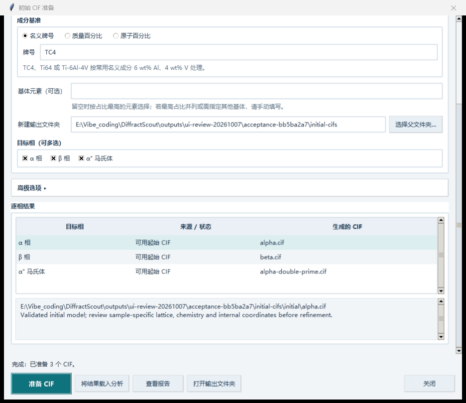
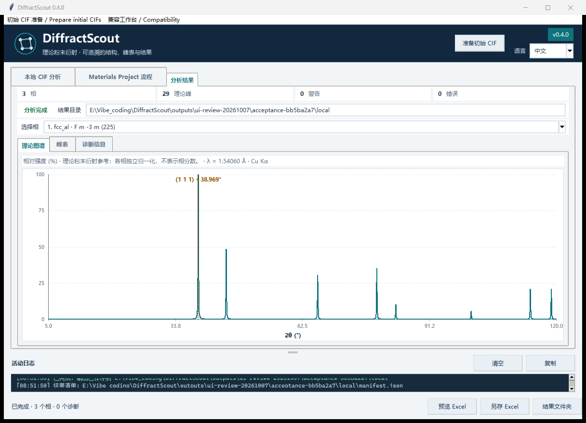

# Graphical interface guide

DiffractScout provides a Tk desktop interface for researchers who prefer to configure and inspect a run without composing command-line arguments. The interface delegates all scientific work to the same tested pipeline functions used by the CLI and Python API.

## Launch

```bash
diffractscout-gui
# equivalent
diffractscout gui
# or: python -m diffractscout gui
```

On Windows, after an editable or environment install, double-click
`启动DiffractScout.bat` in the repository root. The repository launcher uses
the checkout source and prefers interpreters in this order: the repository
`.venv\Scripts\python.exe`, the current/active `python`, then `py -3`. These
source launchers require Python. The
repository launcher is only a convenient source-checkout entry point; an
installed `diffractscout-gui` or `diffractscout gui` does not require it. The
`scripts/package_windows_portable.py --build` command now builds a separate
portable executable after installation of `.[complete,windows]`. Its generated
`start_gui.bat` launches the bundled desktop without a Python installation.

Install `.[complete]` to enable both inherited workbenches under the
**Compatibility / 兼容工作台** menu. The CIF2Peaks workbench retains its original
publication formats and Excel views; PhaseScout retains its original candidate
selection and download interface. Both run from this package in separate windows.
See [the replacement audit](REPLACEMENT_AUDIT.md) for CLI-only inherited options.

A normal Python installation with Tk support is required. On Linux, the operating-system package is commonly named `python3-tk` or `tk`.

Optional extra `.[gui-dnd]` installs `tkinterdnd2` and enables file/folder drop onto the local CIF list; the button-based workflow remains available without it.

The GUI starts in Chinese (`zh`). Use the language selector in the header to
switch between Chinese and English. Screenshots in this guide are
illustrative and may show English labels even though a fresh launch defaults
to Chinese.

## Layout and scrolling

The workbench separates **Local CIF analysis**, **Materials Project**, and
**Analysis results**. Common radiation, scan-range and export controls appear
first. **Profile and d-spacing**, **Resource limits**, and **Cij** settings expand
on demand; collapsing them retains their values. Chinese and English choices
map to the same canonical settings used by the CLI and API.

Both form columns scroll with the mouse wheel or scrollbar. Keyboard focus
automatically reveals controls inside the scroll area. Primary **Analyze / Run**
actions remain pinned below the form, with a next-step message that identifies
missing inputs or the output folder. Use **Ctrl+Enter** to run the active
workflow once its required inputs are ready, and **Delete** in the local input
list to remove selected paths. The Activity log remains in a resizable vertical
split. The default size is `1200×820`, with a minimum of `900×640`; text wraps to
its actual column width.

## Contextual help

Pause over a control to see what it does, how to use it, and what changes after
the action. Buttons remain readable when disabled, with the required earlier
step explained in their help. Keyboard focus also shows help; press **F1** to
show it again and **Esc** to dismiss it. Clicking, typing, leaving the control,
or resizing the window dismisses the bubble without changing the control's
value or taking keyboard focus.

Help covers the main workflows, initial CIF preparation, result tables and
both compatibility workbenches. Each drop-down option and result-table heading
has its own explanation. Units and terms such as CIF, FWHM, d, q and stiffness
constants are explained in context. Chinese and English help follows the main
window's language setting; the retained PhaseScout downloader uses Chinese.

The [help acceptance record](evidence/gui-help-20261007.md) contains actual
Windows captures and interaction checks, including the compatibility views.

## Local CIF analysis


1. Select one or more individual CIF files and/or folders.
2. Choose whether selected folders should be scanned recursively.
3. Select the result directory.
4. Define radiation and profile settings.
5. Set the profile-grid and reciprocal-candidate safety limits.
6. Choose whether compatible numerical elastic sidecars should be paired.
7. Run the analysis; the workbench opens **Analysis results** automatically.

Input rows show the filename first and its parent folder, with horizontal
scrolling for long paths. Selecting one input displays its complete path.
Language changes retain the input selection and all calculation settings.

Duplicate input paths are removed. Only readable files with the `.cif` extension enter the calculation. Selecting `Replace an existing verified DiffractScout bundle` authorizes replacement only when the existing directory contains a supported manifest and currently passes the bundle-integrity check.

## Reuse analysis settings

Use **Save parameters** to store the current analysis and export options in a
JSON preset, and **Load parameters** to reuse them for another input set. Presets
include radiation, angular and d-spacing ranges, profile parameters, resource
limits, optional outputs, and the local recursive-scan option. The complete
preset is validated before it changes the form.

Presets do not contain API keys, input or output paths, overwrite authorization,
or manually entered elastic tensors. Loading one therefore leaves those
choices with the current run. Save/load actions are disabled during a task.

## Materials Project pipeline


The query can be an alloy grade, chemical formula, chemical system, or explicit Materials Project identifiers. The form exposes:

- discovery mode;
- maximum energy above hull;
- maximum subsystem order;
- maximum records per subsystem;
- maximum total candidates;
- deprecated-record inclusion;
- conventional-standard or primitive cell selection;
- optional frame-compatible elastic-tensor evaluation;
- the same radiation, profile, resource, Excel, and overwrite controls as the local workflow.

The API key remains in process memory. DiffractScout does not save it in configuration, result, log, or repository files. Users should still remove keys before sharing screenshots, terminal history, or diagnostic material.

## Prepare starting CIFs



Choose **Prepare initial CIFs / 初始 CIF 准备** from the menu to open the
standalone phase-preparation window. Enter an element system such as `Ti-Al-V`,
choose the composition basis, select phases, and choose a new output folder.
The form and per-phase results scroll vertically on shorter screens; the
status and main action buttons remain fixed at the bottom.
For the common nominal `TC4`, `Ti64`, or `Ti-6Al-4V` grade, the form starts
with `TC4`; the workflow interprets it as 6 wt% Al, 4 wt% V, balance Ti. For
other alloys, enter the complete composition, such as `Ti=90,Al=6,V=4` wt% or
`Ti=86,Al=10,V=4` at%. The optional host defaults to the element with the
largest supplied fraction; specify it explicitly for ties or a different
parent lattice.

The advanced section accepts a literature-parameter JSON, per-phase template
CIFs, an optional Materials Project key, and an offline switch. Leave the key
empty to use `MP_API_KEY` from the process environment. The GUI does not store
the key. Offline Ti runs can use packaged, cited prototypes; a non-Ti system
must use its own compatible prototypes or templates. If no literature
parameters are provided, the generated files remain explicitly labelled
starting models with the prototype lattice retained as an initial assumption.
The program does not search or interpret papers.

Use **Prepare initial CIFs** in the main header to open this workflow. Its
controls share the workbench typography and styles. The result table reports
each requested phase and its source/status, with the complete record note in
a scrollable detail area below the table. Completion scrolls to the results.
Use **View report** for the complete
provenance report, **Open output folder** to inspect files, or **Load results
for analysis** to add the generated CIFs and switch the main window to local
analysis. The worker never accesses Tk widgets; closing this dialog stops its UI
polling while the preparation can finish writing the requested output. A
successful or partial result remains in the selected output folder.

These CIFs are starting structures. A database or packaged prototype's
composition and lattice do not become measurements of the target alloy, and
the workflow does not identify phases, infer equilibrium partitioning, or
replace refinement against experimental data.

## Radiation controls

| Mode | Required control | Interpretation |
|---|---|---|
| `source` | Built-in source preset | Uses the documented effective wavelength for Cu, Co, Fe, Mo, or Ag Kα |
| `source` + `Custom` | Radiation value | Interpreted as wavelength in Å |
| `wavelength` | Radiation value | Explicit wavelength in Å |
| `energy` | Radiation value | Explicit photon energy in keV |

Energy and wavelength inputs must be finite and positive. The CLI also makes explicit energy and wavelength options mutually exclusive.
When the source preset is `Custom`, the GUI value is wavelength in Å only. The
active field label always shows Å or keV, and a mode change carries a valid
previous value only through an explicit physical conversion; invalid values are
cleared for explicit re-entry. A built-in source ignores stale text left in the
disabled radiation-value field.

## Scientific controls

- `2θ min` and `2θ max` define the reflection and profile window.
- `Step` controls only the continuous display-profile grid.
- `FWHM` and pseudo-Voigt `η` define the display broadening.
- `Profile points` rejects a requested grid above the configured count before allocation.
- `Reciprocal candidates` rejects a conservative Miller-candidate estimate, and then the actual candidate list, above the configured limit.
- Elasticity pairing calculates a directional modulus only for a valid 6×6 stiffness tensor with an explicitly compatible coordinate frame.
- **Pair numerical elasticity sidecars** / **Evaluate frame-compatible elasticity** and **Write Excel workbook** appear under Outputs on each tab.

The discrete indexed reflection table remains the primary scientific result. Profile parameters do not represent an inferred instrument function.

## Parity and lab-oriented options

The shared desktop form exposes radiation, angular window, *d*-spacing filters,
profile model, profile spacing, pseudo-Voigt η, resource guards, pattern axis,
elasticity pairing, continuous patterns, figures, Excel, and lab views. The same
settings are available through the CLI and Python `AnalysisSettings`:

| Control | Default in GUI path | CLI / settings |
|---|---|---|
| *d*-spacing filter | off (`d_min_A` / `d_max_A` = `None`) | `--d-min`, `--d-max` |
| Profile lineshape | `pseudo_voigt` | `--profile-model` (`pseudo_voigt`, `gaussian`, `lorentzian`) |
| CSV/Excel pattern coordinate | `two_theta` | `--pattern-axis` (`two_theta`, `d_spacing`, `q`, `g`); selects the `x` field in `pattern_profiles.csv` and Excel only |
| Laboratory Excel views | on (`export_lab_views=True`) | `--no-lab-views` to disable Chinese `推荐峰表` / `使用说明` sheets |
| Continuous pattern series | on | `--no-patterns` |
| 2θ figure generation | off | `--figures`, `--figure-preset`; v0.4.0 figures remain on 2θ regardless of `--pattern-axis`; SVG/PNG bundle output works in the base install and `.[figures]` enables the matplotlib path |

Laboratory views add bilingual convenience sheets to `results.xlsx` without changing the English canonical CSV columns. The workbook also provides a result overview, worksheet links, column-group colors, consistent number formats, and intensity bars. See the [Excel guide](EXCEL.md), [SCHEMA_ALIASES.md](SCHEMA_ALIASES.md), and [ENGINE_PARITY.md](ENGINE_PARITY.md).

The desktop label intentionally says “CSV/Excel pattern coordinate.” For the
reciprocal choices, `q=2π/d` and `g=1/d` in Å⁻¹. These choices affect only
continuous CSV/Excel profiles; figures remain on the simulated `two_theta_grid`
and are labeled as 2θ. Lab views are available only when Excel output is on.

## Quick export (no full form)

For a Cu Kα, 5–120° lab-default one-shot export without opening the notebook UI:

```bash
diffractscout-quick-export path/to/sample.cif -o path/to/sample_out.xlsx
# explicit custom radiation (the options are mutually exclusive)
diffractscout-quick-export path/to/sample.cif -o path/to/sample_out.xlsx --source Custom --wavelength-A 1.2
diffractscout-quick-export path/to/sample.cif -o path/to/energy_out.xlsx --energy-keV 20
# or
diffractscout quick-export path/to/cifs -o path/to/bundle_dir
```

On Windows, drag CIF files or folders onto `quick_export_diffractscout.bat`. The script normalizes a trailing folder separator and writes `<first-stem>_diffractscout.xlsx` next to the first input (bundle: `<stem>_diffractscout_bundle/`). Like the GUI launcher, it prefers the repository `.venv`, then an installed `diffractscout-quick-export` command, then `python` / `py -3` with `scripts/diffractscout_entry.py`, so a README venv install works without activating the environment.

An existing workbook is never replaced implicitly. Choose a different path or enable the explicit overwrite option; an authorized replacement is written through a temporary file so a failed copy does not expose a partial workbook.

For the Python `quick_export` helper, supplying exactly one `energy_keV` or
`wavelength_A` keyword infers the matching input mode. Supplying both, or
combining one with a conflicting explicit `input_mode`, raises before the
output target is created. With `settings=AnalysisSettings(...)`, a radiation
keyword overrides the baseline radiation mode; only an explicitly supplied
conflicting `input_mode` keyword raises. The explicit
`source_preset="Custom"` + `wavelength_A` source-mode contract remains. The
helper also normalizes inactive direct-settings radiation fields immediately
before pipeline validation: energy mode clears wavelength, wavelength mode
clears energy, built-in source mode clears both, and `Custom` keeps wavelength
while clearing energy. Contradictory explicit radiation overrides still raise.
The resulting Summary keeps `two_theta_range_deg` as the requested range, adds the explicit
alias `requested_two_theta_range_deg`, records configured per-phase bounds in
`analysis_two_theta_range_deg` and actual sample endpoints in
`profile_sampled_two_theta_range_deg`, and adds
`effective_two_theta_range_deg`, `effective_wavelength_A`,
`effective_energy_keV`, `effective_radiation_source`, and
`source_preset_applied`.

## Analysis results



A completed run opens a result overview with phase, indexed-peak, warning and
error counts and its output path. Select a phase to inspect its space group,
theoretical 2θ pattern and indexed peak table on separate tabs. Click a numerical table heading
to sort and use the page controls for large peak tables. Select a peak and
choose **Locate in pattern**, double-click its row, or press **Enter** to show
its indexed position on the plot. Missing directional elastic moduli appear as `—`.

The preview displays the actual wavelength and uses the pipeline's returned
arrays and reflections. Without a continuous profile, it shows a stick pattern.
Curves retain
the minimum and maximum of each display bucket so narrow peaks remain visible
when a large profile is drawn into a small plot. Each phase is normalized
independently for display; these intensities do not represent phase fractions.
The plot remains on **2θ (°)** even when CSV/Excel profiles use `d`, `q` or `g`.
Exports retain the complete data and original numerical definitions.

The **Diagnostics** page provides severity filters and full messages. A run
with no analyzable phases still exposes its diagnostics and result folder.
Routine completion is reported in the result page and Activity log without a
modal confirmation dialog.

See the [desktop acceptance record](evidence/desktop-ui-20261007.md) for
actual workflow checks and reference views at the minimum window size.

## Activity log and completion states

The Activity panel reports timestamps and separates informational, warning, and error diagnostics. A completed bundle can contain diagnostic errors for individual phases that failed while other phases succeeded. Completion messages therefore distinguish:

- successful completion without error diagnostics;
- completion with one or more error diagnostics;
- completion with no analyzable phases, where a diagnostic-only bundle is still available.

Completion reports the phase, reflection, warning, and error counts. **Preview
Excel**, **Save Excel as**, and **Result folder** provide separate result
actions. Excel actions require an existing workbook; the folder action also
works for runs without Excel. These actions are disabled during a task, and a
failed retry retains access to the previous result while its files still exist.

Preview opens a temporary copy outside the verified bundle. Use **Save Excel
as** for a permanent editable copy. Saved changes in a preview are retained on
exit, with their location reported, instead of being discarded. See the
[Excel guide](EXCEL.md) for the workbook layout and editing workflow. `Copy`
places the current Activity log on the clipboard; `Clear` affects only the
displayed log.

## Threading and window closure

One pipeline task can run at a time. Run buttons are disabled while a worker thread is active, preventing duplicate downloads or simultaneous writes to the same target. All run options are validated and snapshotted on the GUI thread before the worker starts, so later interface edits cannot change an in-flight run and the worker never reads Tk state. Closing the window during a task is blocked with an informational message; there is no force-close or cancel action, so wait for the worker to publish its safe completion before closing. The scientific output transaction remains responsible for preserving an existing valid bundle when a run fails.

## Headless GUI validation

CI installs the test extra and runs both an application construction smoke and
the desktop, CIF preparation and result-view tests under Xvfb on Linux:

```bash
xvfb-run -a python -c \
  "from diffractscout.gui import create_app; app=create_app(); app.update(); app.destroy()"
xvfb-run -a pytest -q tests/test_gui.py tests/test_gui_cifs.py \
  tests/test_gui_results.py tests/test_gui_help.py tests/test_compat_gui_help.py
```

The smoke validates import, widget construction, layout initialization, and
clean shutdown; the interaction tests exercise settings, transitions,
layout, worker interaction, result navigation and plot display. Numerical workflows are tested separately
through the headless API and CLI.
