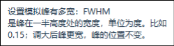
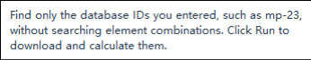
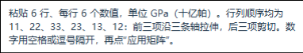
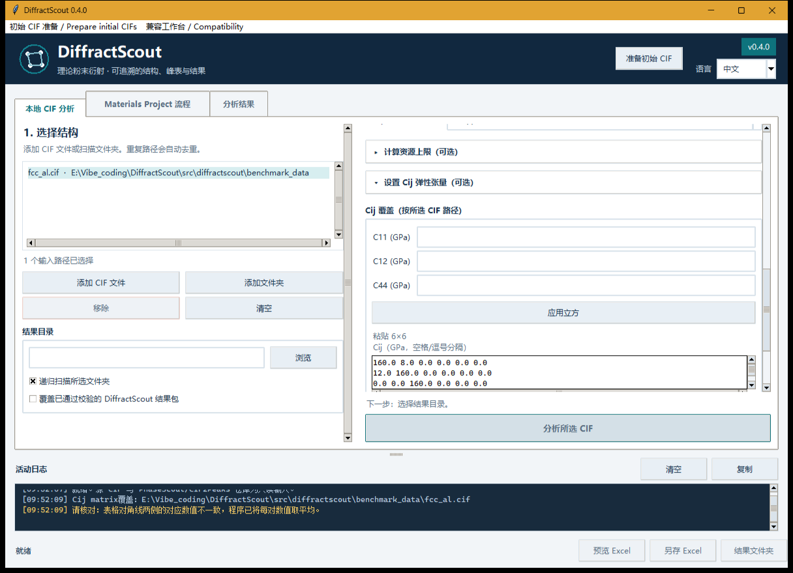

# Contextual help acceptance — 7 October 2026

The main desktop, initial CIF preparation, results and both compatibility
workbenches now use one delayed, non-modal help implementation. The main
catalog contains 147 Chinese/English pairs; CIF2Peaks contains 57 bilingual
help messages. PhaseScout retains Chinese help.

Control inventories cover buttons, entries, choices, checkboxes, tabs, tables,
editable matrix cells and scrollbars, including collapsed settings and disabled
actions. Individual dropdown items and table headings explain their meanings;
column boundaries explain resizing. Help describes the action, any required
earlier step and its result. Scientific units and abbreviations are explained
where they occur. For example:

The full stiffness matrix uses the existing Voigt order 11,22,33,23,13,12.
Help explains stretching and shearing entries and that manual values remain
only in the current window. Existing validator warnings about averaging an
asymmetric matrix or sensitivity to small errors now appear in the field
status and activity log. Calculation, source-file handling and export schemas
were not changed.

## Actual UI checks

Windows acceptance used Python 3.12.10 and Tk 8.6, based on commit
`4bd0bd8638506ec8db32188479b0af6f5f6beb89`. CLI children ran on a private
desktop without switching the user's desktop or moving the system pointer.
`PrintWindow` captured only application-owned windows. All nine retained
images are unedited; their copied SHA-256 values matched the originals.

Chinese and English help was inspected at 1200×820 and 900×640, with the
preparation dialog at 900×660. Bubbles fit within their owner window and use
the existing font and colour system. Hovering or using F1 does not execute an
action or alter selection; keyboard focus stays in the control. Leaving,
clicking, typing, Esc, resizing and closing dismiss help and cancel its timer.
Disabled buttons retain readable explanations without becoming enabled.

Native dropdown Motion and menu handlers were dispatched through their actual
installed Tcl callbacks. Dropdown keyboard selection and ordinary control
events were generated within the isolated Tk process. This verifies their
rendering and callbacks without simulating OS pointer input. CIF2Peaks was
actually constructed and its matrix help inspected; PhaseScout's energy-column
help was also inspected. No live database call, external application launch or
clipboard action was performed for these captures.

## Regression results and retained files

The affected GUI/settings/compatibility suite initially reported 118 passes
and one optional tkdnd startup failure in 44.76 s. Its loader reported an
unreadable Tcl file that was present on disk. The failed case passed in a fresh
isolated process (1 case, 0.77 s), without changing the loader or skipping it.
Subsequent help and compatibility contract checks passed all 14 cases
(10.83 s). After the warning-display refinement, its new regression, help,
compatibility and settings checks passed all 28 cases (13.66 s).

Ruff, compilation of changed sources, document checks and whitespace checks
passed. CI now also runs the new help/compatibility tests with a Linux Xvfb
display. These are engineering checks; experimental phase identification and
new numerical definitions are outside this change.

The first remote run exposed a test-collection error in the minimal GUI job:
the compatibility test imported its optional `pymatgen` engine before checking
whether it was installed. Its imports now occur through a guarded test fixture,
and the existing complete-edition Xvfb job explicitly runs all compatibility
help tests. Minimal installations still exercise the main interface and the
independent PhaseScout help; complete installations exercise both workbenches.
Local complete-environment verification passed all three compatibility checks
(7.71 s). An isolated child that blocked the optional engines passed PhaseScout
and skipped only the two engine-dependent CIF2Peaks checks (0.27 s); it did not
alter the installed environment.

The packaged FCC Al fixture was unchanged. Two generated TC4 test bundles
were checked, moved into the ignored acceptance directory and checked again.
The private harness and generated outputs remain under
`outputs/ui-review-20261007/`: automatic command approval rejected deletion of
that directory during the preceding UI delivery. They are excluded from Git.
The [machine-readable record](gui-help-20261007.json) contains capture text,
dimensions, input and screenshot hashes, test outcomes and retained locations.
