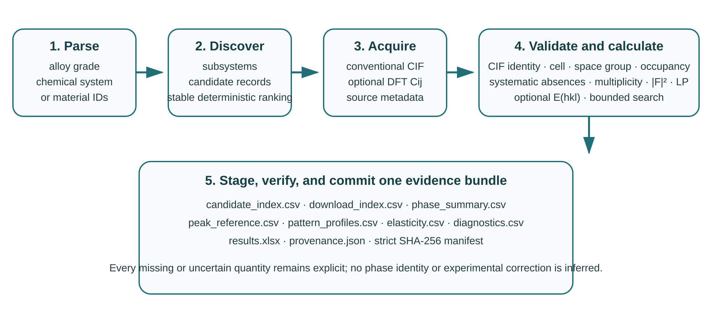

# Summary

`DiffractScout` is an open-source Python package that connects candidate-phase discovery to traceable theoretical powder X-ray diffraction references. A user can supply an alloy grade, chemical system, Materials Project identifiers, or local Crystallographic Information Files (CIFs). The software expands chemical subsystems when required, normalizes and ranks candidate records, downloads conventional structures and optional computed elastic tensors, validates each artifact, calculates indexed powder reflections, and writes a self-contained evidence bundle. Reflection records contain $hkl$, $d$, $2\theta$, $q$, reciprocal spacing, multiplicity, X-ray structure-factor terms, explicit Lorentz-polarization channels, and an optional Young's modulus along the reciprocal-lattice normal. Bundles include source metadata, settings, software versions, input hashes, structured diagnostics, CSV and spreadsheet tables, and a strict SHA-256 inventory. The package provides a command-line interface, Python API, desktop interface, and fully offline synthetic verification workflow.

# Statement of need

Candidate-phase assessment in alloy and diffraction research often spans disconnected operations. Researchers translate a grade name into an element set, enumerate binary and higher-order subsystems, search computed-materials databases, download CIF records, inspect space-group and stability metadata, generate theoretical peak positions, locate elastic constants, and transfer results into spreadsheets or plotting programs. Although each operation is available in existing libraries, ad hoc pipelines frequently lose the relationship between the database record, exact CIF setting, tensor basis, radiation definition, warnings, and exported table. Consequences include duplicated candidates, untraceable values, coordinate-frame errors, service failures interpreted as absent data, or theoretical intensities compared with experimental peak areas under inconsistent corrections.

`DiffractScout` addresses this workflow-level problem for materials researchers who need auditable candidate references before experimental phase identification, refinement, or mechanical interpretation. It preserves CIF identity [@hall1991], treats Materials Project structures and elastic tensors as computed records [@jain2013], and keeps missing or unusable properties explicit. Database candidates are not reported as experimentally confirmed phases. Missing elastic tensors are not replaced with values inferred from literature text. Continuous profiles are labeled as display products; the indexed line table remains the primary scientific output.

# State of the field

The Materials Project provides computed structures and properties [@jain2013], while `mp-api` and pymatgen supply data-access and materials-analysis objects [@ong2013]. Gemmi provides CIF and crystallographic operations [@wojdyr2022], and spglib supplies independent crystal-symmetry identification [@togo2024]. GSAS-II addresses experimental diffraction reduction, structure solution, and refinement [@toby2013], while pyFAI addresses detector geometry and azimuthal integration [@ashiotis2015]. DiffractScout uses these projects as data sources, upstream libraries, or downstream analysis environments.

Its distinct contribution is the contract across domains: composition interpretation, subsystem queries, candidate deduplication, source acquisition, CIF identity, tensor pairing, theoretical reflection calculation, diagnostics, and export are represented in one versioned data flow. A peak-table addition to a general materials library would not establish the same cross-stage provenance and replacement-safety contract. Adding database search to a refinement suite would combine candidate-reference generation with experimental inverse analysis. DiffractScout therefore delegates general crystallographic and database algorithms to established projects and implements workflow semantics, validation gates, coordinate-frame boundaries, non-destructive output transactions, and reusable result schemas.

# Software design

The package separates provider access, typed domain records, numerical calculation, orchestration, and export. A provider protocol returns normalized candidates and source artifacts. The optional Materials Project adapter records query metadata and requests conventional-standard unit cells. Local CIF analysis remains available in the base installation without a database client. This boundary enables deterministic offline tests and permits additional structure providers without modifying the diffraction engine.

CIF loading requires finite positive cell geometry and atomic sites. Space-group resolution records whether the value came from an explicit symbol, International Tables number, Gemmi inference, or a warned P1 fallback; spglib provides an independent cross-check. Gemmi expands unit-cell sites, evaluates systematic absences, enumerates unique Miller indices, and calculates X-ray structure factors. A dedicated structure-factor copy receives Gemmi's crystallographic-occupancy conversion, preventing special-position multiplicity from being counted twice while preserving original occupancies for validation. The software reports $m|F|^2$ and a channel multiplied by an explicit unpolarized Lorentz-polarization factor. A pseudo-Voigt profile is generated only for visualization. Profile-grid size and a conservative reciprocal-space candidate estimate are checked before memory-intensive allocation.

Elasticity is represented by a finite $6\times6$ stiffness matrix in GPa, source record, nature-of-data label, and coordinate-frame declaration. Matrices are checked for symmetry, invertibility, conditioning, and positive definiteness. Under engineering-shear Voigt convention, the directional modulus is $E(n)=[q(n)^T S q(n)]^{-1}$, where $S=C^{-1}$ and $n$ is the reciprocal-lattice normal of `hkl`. Automatic sidecar pairing requires a unique CIF or material identifier. For Materials Project downloads, directional coupling uses the raw/POSCAR-format tensor paired with the conventional-standard CIF [@materialsproject_elasticity]. IEEE-only records are retained with `frame_transform_required` and produce no directional modulus without a verified rotation.

{#fig:workflow width="100%"}

The output directory is treated as a verifiable research bundle. A run writes to a sibling staging directory, creates all tables and metadata, generates a manifest, and verifies hashes, sizes, safe paths, symbolic-link absence, and unlisted files before moving the directory into place. Replacing an existing bundle requires explicit authorization and successful verification of the current bundle. Rollback preserves the previous valid result if export, verification, or final replacement fails. External text written to spreadsheets is escaped when it resembles an active formula. Structured diagnostics preserve per-phase errors without discarding successful phases.

# Research impact statement

Current pre-submission evidence is a reproducible validation package. The offline suite checks composition parsing, analytic FCC $d$ spacings and systematic absences, special-position structure factors, reflection multiplicities, $q=2\pi/d$, resource limits, a direction-independent $E=110$ GPa for a deliberately isotropic synthetic tensor, elastic-sidecar identity, provider failure semantics, complete discovery-to-export execution, transactional replacement, spreadsheet safety, workbook schemas, and strict manifest tamper detection. CI is configured for Python 3.10--3.13, Windows, macOS, a Linux Xvfb GUI smoke check, wheel installation, and the Open Journals draft workflow. These checks establish the declared numerical and provenance contracts without presenting synthetic values as material-property data.

Before formal submission, this section must be updated with archived evidence of real research use: a representative alloy candidate-screening case connected to an experimental diffraction workflow, independent diffraction and elasticity comparisons with stated tolerances, and documented use or feedback beyond the initial developer. The repository readiness checklist tracks these requirements so that aspirational statements are not substituted for impact evidence.

# AI usage disclosure

OpenAI GPT-5.6 Pro assisted the integration architecture, code and test scaffolding, subsequent bug audit and GUI hardening, documentation drafting, and preparation of this manuscript draft. The PhaseScout and CIF2Peaks repositories were treated as read-only source inputs, and their MIT notices were retained. Before submission, the human author must review and validate every generated or modified component, including numerical definitions, tests, references, source attribution, licensing, documentation, and manuscript claims, and must confirm that primary scientific and architectural decisions reflect human judgment.

# Acknowledgements

Funding, facility acknowledgements, contributors, external validation partners, and the software archive DOI require author confirmation before submission.

# References
