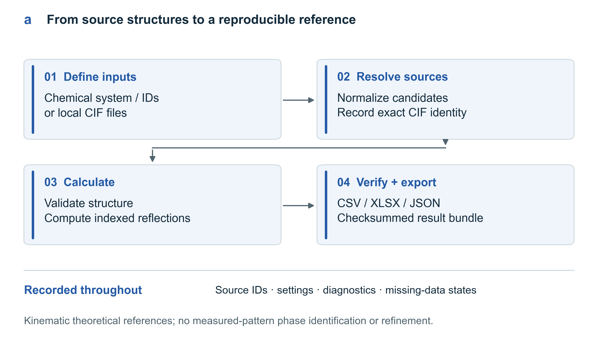
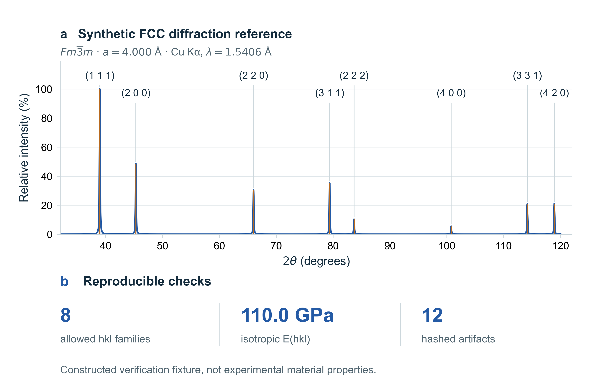

# Summary

Researchers compare measured powder X-ray diffraction (PXRD) patterns with reference lines calculated from candidate crystal structures. Preparing those references requires the structure, its crystallographic setting, the radiation wavelength, and calculation settings to stay linked. DiffractScout is an open-source Python package that turns a composition query or local Crystallographic Information Files (CIFs) into indexed theoretical reflections and optional display profiles [@diffractscout_software]. It supports a command-line interface, a Python interface, and a desktop application. A run packages its structures, settings, data sources, diagnostics, and generated tables with a manifest that can be checked for file changes. The workbook presents an overview and formatted tables, and users can preview it before saving a separate copy. DiffractScout supplies references for experimental planning and interpretation; it does not assign phases in measured patterns or refine experimental data.

# Statement of need

Powder-diffraction phase screening links candidate compositions and crystal structures to expected reflection positions and intensities. In practice, this can involve separate steps for translating an alloy designation, querying a materials database, validating downloaded CIFs, calculating reflections, attaching compatible elastic data, and moving selected values into a spreadsheet. When these steps are performed across separate tools, a candidate's database identity, exact structure, radiation definition, warnings, and calculation settings can be detached from the final table.

DiffractScout addresses this hand-off problem for materials researchers, diffraction users, and students who need theoretical references before or alongside experimental analysis. A run can start from a chemical composition or provider identifier, or directly from local CIF files. It retains the source structure and records how structural and property data were interpreted, then writes machine-readable tables and a reviewable Excel workbook in one result bundle. Local-CIF analysis is available without database credentials. The purpose is to make diffraction-reference generation for candidate phases inspectable and repeatable while leaving experimental interpretation to the researcher.

# State of the field

The Materials Project provides computed structures and properties [@jain2013]; pymatgen supplies materials-analysis objects and calculations [@ong2013]. Gemmi parses CIFs and performs crystallographic operations and structure-factor calculations [@wojdyr2022], while spglib offers a separate crystal-symmetry search [@togo2024]. These packages provide the numerical and data foundations used by DiffractScout. Dans_Diffraction also simulates diffraction from supplied structures [@porter2023], and Elasticipy provides general elasticity and tensor analysis [@depriester2025]. For measured data, GSAS-II supports diffraction reduction and refinement [@toby2013], and pyFAI performs detector calibration and azimuthal integration [@ashiotis2015]. Those experimental tools address a different stage from generating candidate references.

DiffractScout does not replace these packages or introduce a new structure-factor or elasticity algorithm. The project restructures workflow components from PhaseScout and CIF2Peaks [@phasescout_2026; @cif2peaks_2026] around shared records and explicit provenance. Its contribution is the connection between candidate discovery, exact CIF identity, checked tensor association, theoretical reflection output, diagnostics, and a verifiable result bundle. Extending an established crystallography library with another implementation would not by itself preserve those relations across discovery, calculation, and export. The provider boundary also keeps database access optional, so local structure analysis remains usable offline.

# Software design

A provider supplies normalized candidate records and their source artifacts. The Materials Project adapter records query context and source identifiers; the local-CIF path requires no network service. Candidates are deduplicated before download. Each structure record preserves the CIF hash, selected data block, cell, space-group resolution, occupancy state, and diagnostics. Conflicting space-group declarations and partial occupancies remain visible for review rather than being silently repaired [@hall1991].

The diffraction engine uses Gemmi to enumerate symmetry-related reflection families, apply systematic-absence rules, and calculate X-ray structure factors. Results include representative Miller indices, interplanar spacing, scattering-vector magnitude, multiplicity, and separately identified intensity channels with and without the stated Lorentz–polarization correction. A Gaussian, Lorentzian, or pseudo-Voigt profile is generated for display; it is not an instrument-response fit. Configured limits on profile-grid points and reciprocal-space candidate counts are checked before allocation.

Directional Young's moduli can be attached when an elastic tensor is uniquely associated with the CIF and its coordinate frame is usable. The Materials Project's elastic constants are computed data, not experimental measurements [@materialsproject_elasticity]. DiffractScout validates the matrix, unit, conditioning, and positive definiteness before evaluation along a reflection-plane normal. When a downloaded tensor lacks a verified transformation into the CIF Cartesian frame, the software retains its provenance and emits a frame-transformation status without a directional value. This fail-closed policy avoids making a numerically plausible but unsupported tensor-to-structure pairing.

The command-line and desktop interfaces call the same analysis pipeline. The command-line interface accepts reusable parameter presets and can inspect and verify an existing result bundle without rerunning the analysis. The desktop application offers separate result preview, workbook saving, and result-folder actions; versioned parameter presets exclude credentials and file paths. The Excel exporter formats existing result values rather than recalculating them. It adds an overview, readable number formats, filters, frozen phase-identity columns, and grouped technical fields while preserving the corresponding tabular records. CSV and JSON outputs remain available for scripted use.

Each run is first written to a staging directory. Before publication to the requested output path, a verifier checks the manifest's SHA-256 digests and file sizes, path safety, symbolic links, and unlisted files. Replacing an existing result requires explicit authorization and verification of that result. This design makes the completed directory a portable evidence bundle while keeping recovery behavior explicit.

An offline analytic benchmark exercises simple-cubic, body-centered cubic, face-centered cubic, and NaCl selection rules, reflection geometry, structure factors, and cubic-elasticity cases against closed-form expectations. A separate comparison with pymatgen's XRDCalculator [@ong2013] matched all 40 d-spacing groups from four synthetic CIF fixtures. Every matched group met the specified spacing (10⁻⁶ Å) and 2θ (10⁻⁵°) tolerances, and all tested allowed and forbidden reflection rules passed. Directional moduli along [100], [110], and [111] for a synthetic cubic stiffness tensor passed the independent pymatgen-based compliance-tensor comparison [@ong2013]. The automated suite checks analysis and export contracts; continuous integration runs it on Linux for Python 3.10–3.13 and runs selected checks on Windows and macOS. The fixtures make these comparisons reproducible without a database service.

{#fig:workflow width="100%"}

{#fig:validation width="100%"}

# Research impact statement

DiffractScout has been used in the developer's published materials-science research. Each result bundle preserves candidate identity, source structures, calculation settings, diagnostics, and file checksums so that the origin of a calculated reference can be inspected. [Representative publication and matching software-version citation to be supplied before submission.]

# AI usage disclosure

OpenAI GPT-5.6 Pro assisted earlier repository development, testing, documentation, figure production, and manuscript drafting from 30 July to 12 August 2026. In this revision, OpenAI Codex GPT-6 and cooperating assistant agents supported code changes, test scaffolding and review, documentation, citation discovery, manuscript restructuring, and automated verification. Software claims were checked against project source and scientific contracts, references against publisher or upstream records, and automated tests and the analytic benchmark were run. Human author review of the AI-assisted contributions remains pending.

# Acknowledgements

The author acknowledges the developers and maintainers of the open-source software and data services cited above.

# References
